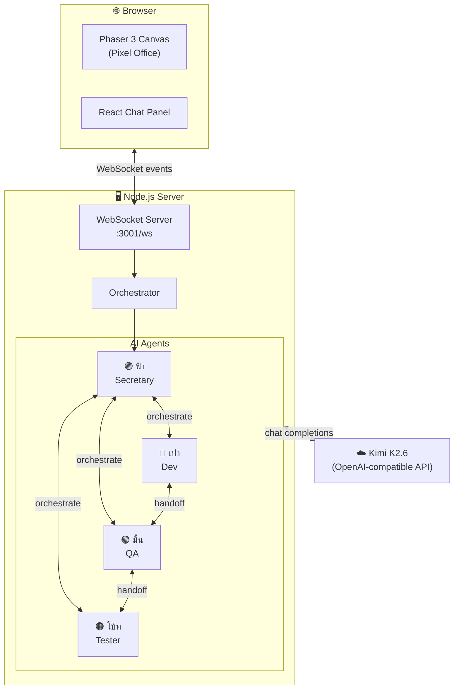
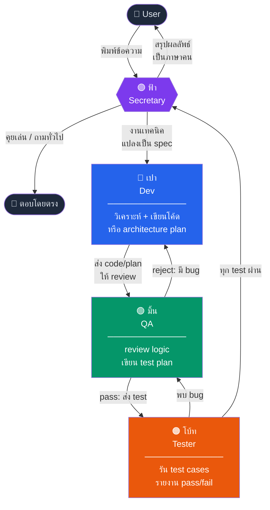
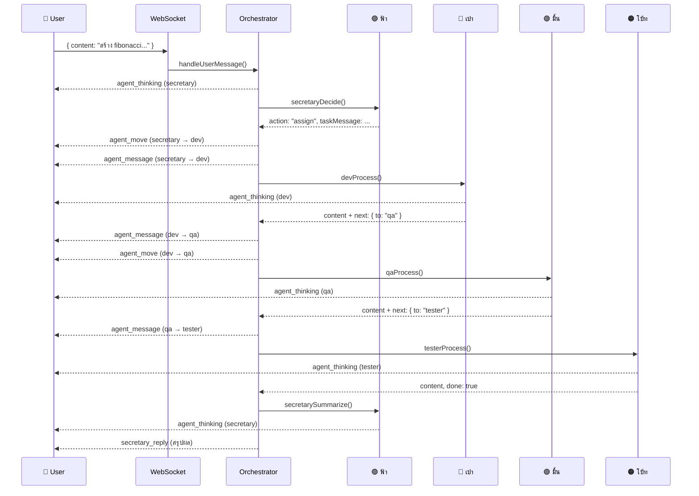

# Pixel Office — Multi-Agent AI Simulation

จำลองออฟฟิศ pixel art (top-down view) ที่ AI agent 4 ตัวทำงานร่วมกัน  
คุยกับเลขา **ฟ้า** ด้วยภาษาธรรมดา — เธอจะแปลงเป็น task และ orchestrate ทีมเอง

## ทีมงาน

| ตัวละคร | บทบาท | หน้าที่ |
|---------|-------|---------|
| ฟ้า 🟣 | Secretary | รับ request, แปลภาษา, orchestrate ทีม |
| เปา 🔵 | Dev | เขียนโค้ด, วาง architecture |
| มิ้น 🟢 | QA | review, หา bug, เขียน test plan |
| โบ้ท 🟠 | Tester | รัน test, รายงานผล |

---

## Architecture



---

## Agent Pipeline



---

## WebSocket Event Flow



---

## Setup

### 1. ตั้งค่า environment

```bash
cp .env.example .env
# แก้ .env ใส่ API key จริง
```

```env
LLM_BASE_URL=https://api.maxplus-ai.cc/kimi/v1
LLM_API_KEY=your-api-key-here
LLM_MODEL=moonshotai/kimi-k2.6
PORT=3001
```

### 2. รัน server

```bash
cd server
npm install
npm run dev
```

### 3. รัน client

```bash
cd client
npm install
npm run dev
```

### 4. เปิดใช้งาน

เปิด [http://localhost:5173](http://localhost:5173)

## การใช้งาน

พิมพ์ข้อความถึงฟ้าในช่อง chat:

- **คุยเล่น**: ฟ้าตอบเองโดยตรง ไม่ involve ทีม
- **งานเทคนิค**: ฟ้าแปลงเป็น spec → ส่งเปา → เปาส่ง QA → QA ส่ง tester → ฟ้าสรุปกลับ

ดูตัวละครเดินในออฟฟิศ pixel art และ speech bubble แสดง real-time

## Tech Stack

- **Frontend**: React + TypeScript + Vite + Phaser 3
- **Backend**: Node.js + Express + WebSocket
- **AI**: Kimi K2.6 via OpenAI-compatible API (swap ได้ผ่าน .env)
