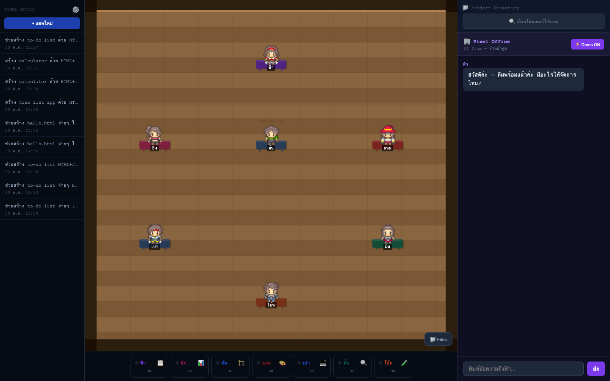
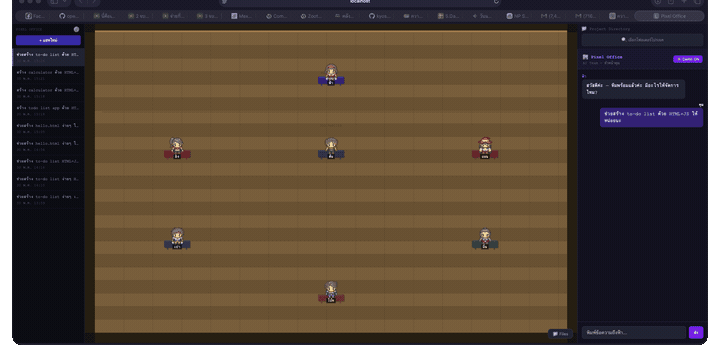
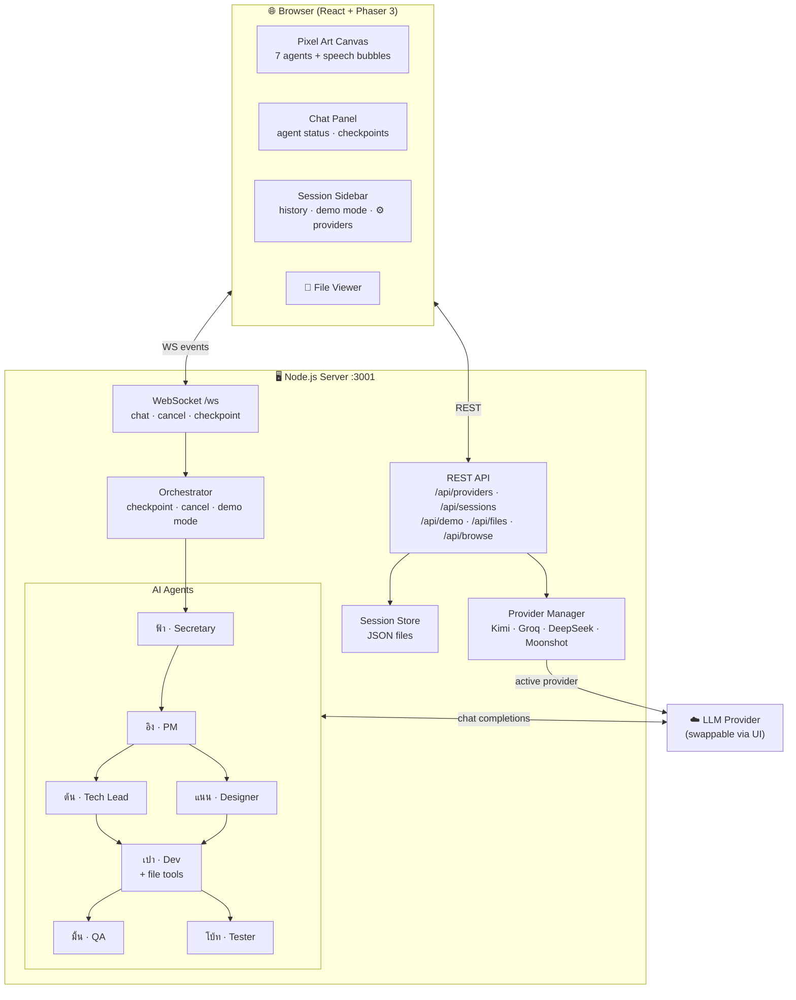
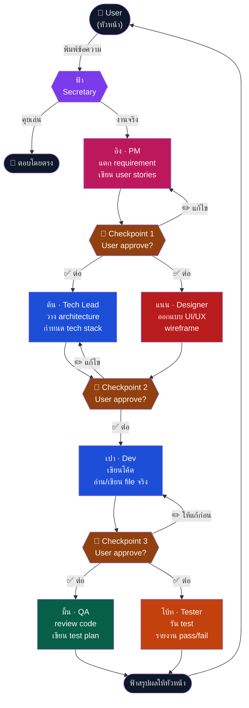
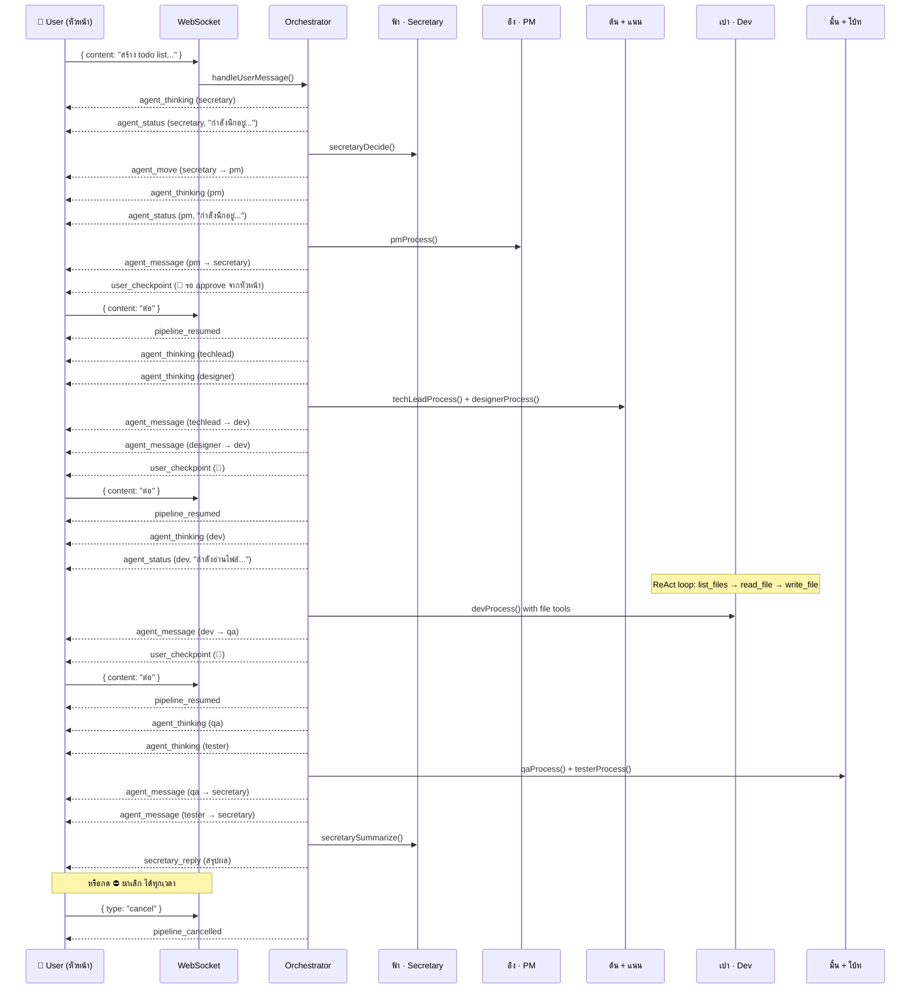

# Pixel Office — Multi-Agent AI Simulation





จำลองออฟฟิศ pixel art (top-down view) ที่ AI agent **7 ตัว** ทำงานร่วมกัน  
คุยกับเลขา **ฟ้า** ด้วยภาษาธรรมดา — เธอแปลเป็น spec แล้ว orchestrate ทีมเอง  
**User คือหัวหน้า** — มี checkpoint ให้ approve งานทุกขั้นตอนสำคัญ

---

## ทีมงาน

| ตัวละคร | บทบาท | นิสัย |
|---------|-------|-------|
| ฟ้า | Secretary | สุภาพ เป็นกันเอง ใช้ "ค่ะ" เสมอ |
| อิง | Product Manager | จู้จี้ requirement ชอบ acceptance criteria |
| ต้น | Tech Lead | ตรงๆ สั้น ชอบ YAGNI |
| แนน | UI/UX Designer | กระตือรือร้น ชอบเสนอ dark mode |
| เปา | Developer | เงียบขรึม ตอบสั้น "โอเค / เดี๋ยวทำ" |
| มิ้น | QA Engineer | หา edge case ไม่ sign-off ถ้ายัง TODO |
| โบ้ท | Tester | รายงาน ✅❌ สั้นๆ ถ้า fail จะ list ยาวมาก |

---

## Architecture



---

## Agent Pipeline



---

## WebSocket Event Flow



---

## Features

| Feature | รายละเอียด |
|---------|-----------|
| 🎮 **Pixel Art Office** | Phaser 3 top-down view, 7 agents เดินได้, speech bubble แสดงเนื้อหาจริง |
| 🤝 **Multi-Agent Pipeline** | PM → Tech Lead + Designer → Dev → QA + Tester ตามลำดับ |
| 🔔 **User Checkpoints** | User approve/แก้ไขงานได้ 3 จุด ก่อนส่งต่อทีม |
| ⛔ **Cancel Pipeline** | หยุด pipeline ได้ทุกเวลา agents หยุดหลัง call ปัจจุบันเสร็จ |
| 📁 **File Tools** | Dev อ่าน/เขียน file จริงใน project directory (sandboxed) |
| 💬 **Session History** | บันทึก chat ทุก session, load กลับได้, ลบได้ |
| ⚡ **Demo Mode** | pipeline เสร็จใน ~13s โดยไม่เรียก LLM เหมาะสำหรับ demo |
| ⚙️ **Multi-Provider** | สลับ LLM ได้ใน UI: Kimi · Moonshot · Groq · DeepSeek + test connection |
| 📊 **Real-time Status** | เห็นสถานะ agent real-time: "กำลังนึกอยู่..." / "งานเข้ามาเยอะ ขอพักซักครู่..." |

---

## Setup

### 1. Clone และติดตั้ง

```bash
git clone https://github.com/kyosuke11z/pixel-office.git
cd pixel-office

cd server && npm install
cd ../client && npm install
```

### 2. ตั้งค่า LLM provider

```bash
# server/.env
LLM_BASE_URL=https://api.maxplus-ai.cc/kimi/v1
LLM_API_KEY=your-key-here
LLM_MODEL=moonshotai/kimi-k2.6
PORT=3001
```

> หรือสลับ provider ได้ใน UI หลังเปิดแอพ โดยกดปุ่ม ⚙️ ที่ sidebar

### 3. รัน

```bash
# Terminal 1
cd server && npm run dev

# Terminal 2
cd client && npm run dev
```

เปิด [http://localhost:5173](http://localhost:5173)

---

## การใช้งาน

- **คุยเล่น**: ฟ้าตอบเองโดยตรง ไม่ involve ทีม
- **สั่งงานจริง**: ระบุ project directory → ทีมทำงาน → approve ที่ checkpoint → เห็นไฟล์จริงใน File Viewer
- **Demo**: กด ⚡ Demo ที่ header เพื่อดู pipeline วิ่งเร็ว 13 วินาที

---

## Tech Stack

- **Frontend**: React + TypeScript + Vite + Phaser 3
- **Backend**: Node.js + Express + WebSocket
- **AI**: OpenAI-compatible API (swappable — Kimi K2.6 / Groq / DeepSeek / Moonshot)
- **Storage**: JSON files (sessions + provider config)
